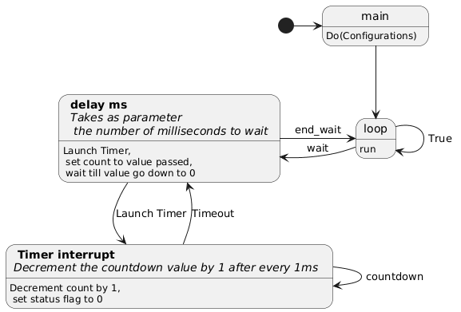
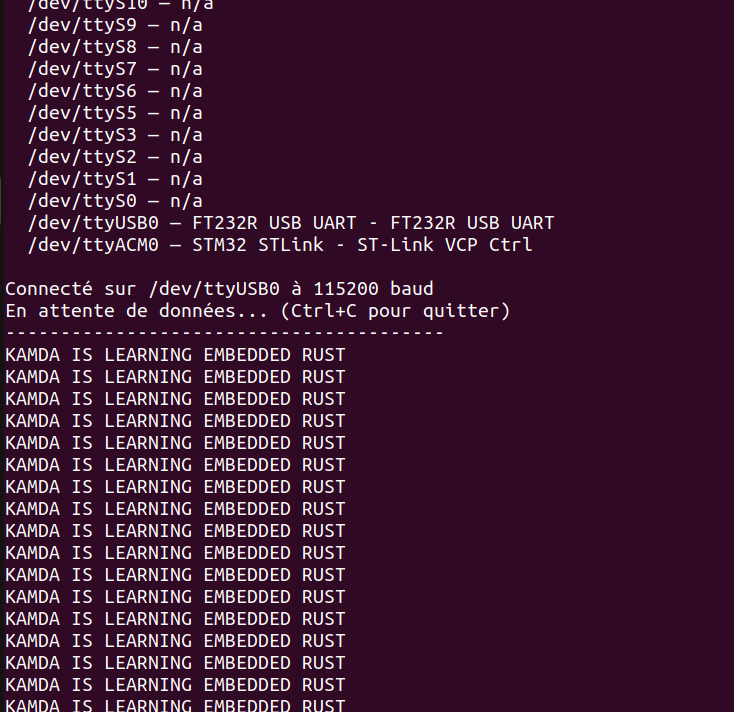

# RUST-AND-STM32
Dans ce Repo, je partage des examples de code RUST implementer sur la carte STM32L476RG.

# Quelques Fonctionnalités Implementé 

#### Explication de la Fonction delay_ms(x)
La figure ci dessous montre le diagrame d'état d'un code qui utilise la fonction delay_ms.\
Ici je montre comment fonctionne la fonction delay_ms que j'ai implementé en Rust en utilisant le timer 2.

#### Resultat de l'envoie de données de l'USART3 vers le PC

